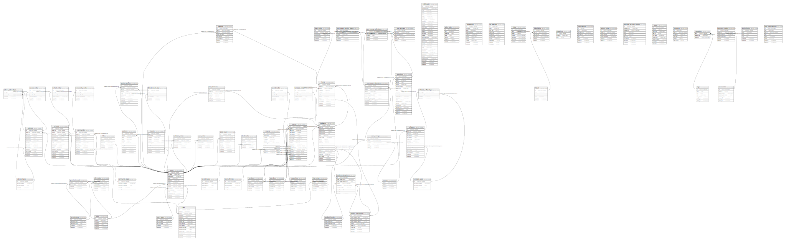

# luminationdev_edspark_phase3_development

## Tables

| Name | Columns | Comment | Type |
| ---- | ------- | ------- | ---- |
| [advice_advicetype](advice_advicetype.md) | 4 |  | BASE TABLE |
| [advice_metas](advice_metas.md) | 6 |  | BASE TABLE |
| [advice_types](advice_types.md) | 5 |  | BASE TABLE |
| [advices](advices.md) | 14 |  | BASE TABLE |
| [attendees](attendees.md) | 6 |  | BASE TABLE |
| [auto_saves](auto_saves.md) | 10 |  | BASE TABLE |
| [bookmarks](bookmarks.md) | 6 |  | BASE TABLE |
| [capacities](capacities.md) | 6 |  | BASE TABLE |
| [catalogues](catalogues.md) | 31 |  | BASE TABLE |
| [communities](communities.md) | 12 |  | BASE TABLE |
| [community_metas](community_metas.md) | 6 |  | BASE TABLE |
| [community_types](community_types.md) | 5 |  | BASE TABLE |
| [event_formats](event_formats.md) | 5 |  | BASE TABLE |
| [event_metas](event_metas.md) | 6 |  | BASE TABLE |
| [event_types](event_types.md) | 5 |  | BASE TABLE |
| [events](events.md) | 18 |  | BASE TABLE |
| [exports](exports.md) | 11 |  | BASE TABLE |
| [failed_import_rows](failed_import_rows.md) | 6 |  | BASE TABLE |
| [failed_jobs](failed_jobs.md) | 7 |  | BASE TABLE |
| [feedbacks](feedbacks.md) | 10 |  | BASE TABLE |
| [hardware_metas](hardware_metas.md) | 6 |  | BASE TABLE |
| [hardwares](hardwares.md) | 19 |  | BASE TABLE |
| [imports](imports.md) | 11 |  | BASE TABLE |
| [job_batches](job_batches.md) | 10 |  | BASE TABLE |
| [jobs](jobs.md) | 7 |  | BASE TABLE |
| [labellables](labellables.md) | 6 |  | BASE TABLE |
| [labels](labels.md) | 6 |  | BASE TABLE |
| [likes](likes.md) | 6 |  | BASE TABLE |
| [loan_histories](loan_histories.md) | 7 |  | BASE TABLE |
| [loan_metas](loan_metas.md) | 6 |  | BASE TABLE |
| [loans](loans.md) | 12 |  | BASE TABLE |
| [locations](locations.md) | 6 |  | BASE TABLE |
| [migrations](migrations.md) | 3 |  | BASE TABLE |
| [notifications](notifications.md) | 8 |  | BASE TABLE |
| [partner_metas](partner_metas.md) | 6 |  | BASE TABLE |
| [partner_profiles](partner_profiles.md) | 11 |  | BASE TABLE |
| [partners](partners.md) | 11 |  | BASE TABLE |
| [permission_role](permission_role.md) | 4 |  | BASE TABLE |
| [permissions](permissions.md) | 5 |  | BASE TABLE |
| [personal_access_tokens](personal_access_tokens.md) | 10 |  | BASE TABLE |
| [product_brands](product_brands.md) | 5 |  | BASE TABLE |
| [product_categories](product_categories.md) | 9 |  | BASE TABLE |
| [product_inventories](product_inventories.md) | 9 |  | BASE TABLE |
| [questions](questions.md) | 20 |  | BASE TABLE |
| [role_metas](role_metas.md) | 6 |  | BASE TABLE |
| [roles](roles.md) | 6 |  | BASE TABLE |
| [rsvps](rsvps.md) | 9 |  | BASE TABLE |
| [school_metas](school_metas.md) | 6 |  | BASE TABLE |
| [schools](schools.md) | 16 |  | BASE TABLE |
| [sessions](sessions.md) | 6 |  | BASE TABLE |
| [site_metas](site_metas.md) | 6 |  | BASE TABLE |
| [sites](sites.md) | 15 |  | BASE TABLE |
| [software_metas](software_metas.md) | 6 |  | BASE TABLE |
| [software_softwaretype](software_softwaretype.md) | 4 |  | BASE TABLE |
| [software_types](software_types.md) | 5 |  | BASE TABLE |
| [softwares](softwares.md) | 15 |  | BASE TABLE |
| [surveys](surveys.md) | 4 |  | BASE TABLE |
| [taggables](taggables.md) | 3 |  | BASE TABLE |
| [tags](tags.md) | 7 |  | BASE TABLE |
| [taxonomies](taxonomies.md) | 7 |  | BASE TABLE |
| [taxonomy_metas](taxonomy_metas.md) | 6 |  | BASE TABLE |
| [technologies](technologies.md) | 6 |  | BASE TABLE |
| [user_answers](user_answers.md) | 6 |  | BASE TABLE |
| [user_metas](user_metas.md) | 6 |  | BASE TABLE |
| [user_notifications](user_notifications.md) | 8 |  | BASE TABLE |
| [user_survey_action_plans](user_survey_action_plans.md) | 6 |  | BASE TABLE |
| [user_survey_domains](user_survey_domains.md) | 11 |  | BASE TABLE |
| [user_survey_reflections](user_survey_reflections.md) | 5 |  | BASE TABLE |
| [user_surveys](user_surveys.md) | 6 |  | BASE TABLE |
| [user_types](user_types.md) | 5 |  | BASE TABLE |
| [users](users.md) | 14 |  | BASE TABLE |
| [waitlists](waitlists.md) | 8 |  | BASE TABLE |

## Relations

---

> Generated by [tbls](https://github.com/k1LoW/tbls)
