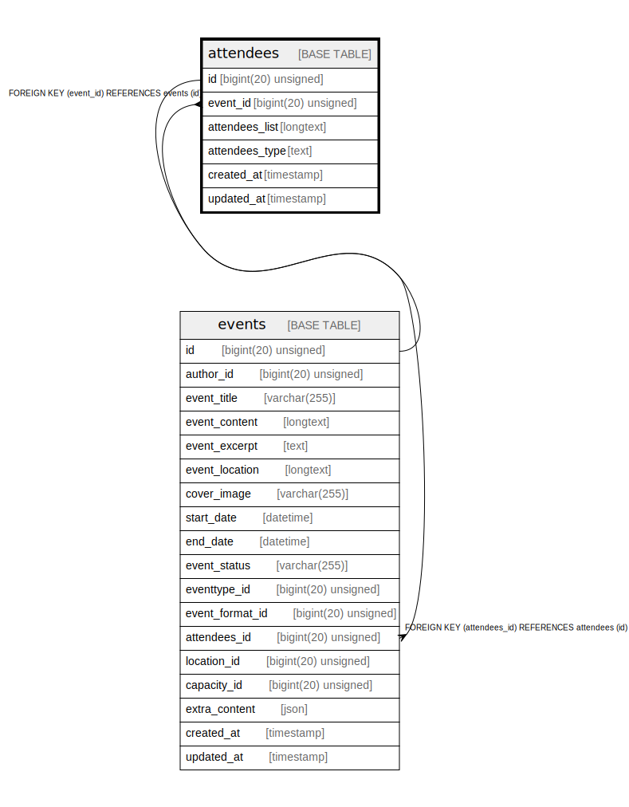

# attendees

## Description

<details>
<summary><strong>Table Definition</strong></summary>

```sql
CREATE TABLE `attendees` (
  `id` bigint(20) unsigned NOT NULL AUTO_INCREMENT,
  `event_id` bigint(20) unsigned DEFAULT NULL,
  `attendees_list` longtext COLLATE utf8mb4_unicode_ci NOT NULL,
  `attendees_type` text COLLATE utf8mb4_unicode_ci NOT NULL,
  `created_at` timestamp NULL DEFAULT NULL,
  `updated_at` timestamp NULL DEFAULT NULL,
  PRIMARY KEY (`id`),
  KEY `attendees_event_id_foreign` (`event_id`),
  CONSTRAINT `attendees_event_id_foreign` FOREIGN KEY (`event_id`) REFERENCES `events` (`id`) ON DELETE CASCADE
) ENGINE=InnoDB DEFAULT CHARSET=utf8mb4 COLLATE=utf8mb4_unicode_ci
```

</details>

## Columns

| Name | Type | Default | Nullable | Extra Definition | Children | Parents | Comment |
| ---- | ---- | ------- | -------- | ---------------- | -------- | ------- | ------- |
| id | bigint(20) unsigned |  | false | auto_increment | [events](events.md) |  |  |
| event_id | bigint(20) unsigned |  | true |  |  | [events](events.md) |  |
| attendees_list | longtext |  | false |  |  |  |  |
| attendees_type | text |  | false |  |  |  |  |
| created_at | timestamp |  | true |  |  |  |  |
| updated_at | timestamp |  | true |  |  |  |  |

## Constraints

| Name | Type | Definition |
| ---- | ---- | ---------- |
| attendees_event_id_foreign | FOREIGN KEY | FOREIGN KEY (event_id) REFERENCES events (id) |
| PRIMARY | PRIMARY KEY | PRIMARY KEY (id) |

## Indexes

| Name | Definition |
| ---- | ---------- |
| attendees_event_id_foreign | KEY attendees_event_id_foreign (event_id) USING BTREE |
| PRIMARY | PRIMARY KEY (id) USING BTREE |

## Relations



---

> Generated by [tbls](https://github.com/k1LoW/tbls)
