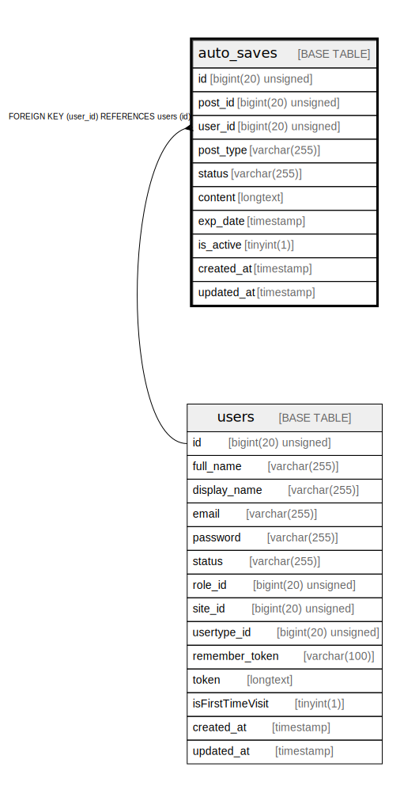

# auto_saves

## Description

<details>
<summary><strong>Table Definition</strong></summary>

```sql
CREATE TABLE `auto_saves` (
  `id` bigint(20) unsigned NOT NULL AUTO_INCREMENT,
  `post_id` bigint(20) unsigned DEFAULT NULL,
  `user_id` bigint(20) unsigned NOT NULL,
  `post_type` varchar(255) COLLATE utf8mb4_unicode_ci NOT NULL,
  `status` varchar(255) COLLATE utf8mb4_unicode_ci NOT NULL DEFAULT 'auto-saved',
  `content` longtext COLLATE utf8mb4_unicode_ci NOT NULL,
  `exp_date` timestamp NULL DEFAULT NULL,
  `is_active` tinyint(1) NOT NULL DEFAULT '1',
  `created_at` timestamp NULL DEFAULT NULL,
  `updated_at` timestamp NULL DEFAULT NULL,
  PRIMARY KEY (`id`),
  KEY `auto_saves_user_id_index` (`user_id`),
  KEY `auto_saves_is_active_index` (`is_active`),
  CONSTRAINT `auto_saves_user_id_foreign` FOREIGN KEY (`user_id`) REFERENCES `users` (`id`) ON DELETE CASCADE
) ENGINE=InnoDB AUTO_INCREMENT=[Redacted by tbls] DEFAULT CHARSET=utf8mb4 COLLATE=utf8mb4_unicode_ci
```

</details>

## Columns

| Name | Type | Default | Nullable | Extra Definition | Children | Parents | Comment |
| ---- | ---- | ------- | -------- | ---------------- | -------- | ------- | ------- |
| id | bigint(20) unsigned |  | false | auto_increment |  |  |  |
| post_id | bigint(20) unsigned |  | true |  |  |  |  |
| user_id | bigint(20) unsigned |  | false |  |  | [users](users.md) |  |
| post_type | varchar(255) |  | false |  |  |  |  |
| status | varchar(255) | auto-saved | false |  |  |  |  |
| content | longtext |  | false |  |  |  |  |
| exp_date | timestamp |  | true |  |  |  |  |
| is_active | tinyint(1) | 1 | false |  |  |  |  |
| created_at | timestamp |  | true |  |  |  |  |
| updated_at | timestamp |  | true |  |  |  |  |

## Constraints

| Name | Type | Definition |
| ---- | ---- | ---------- |
| auto_saves_user_id_foreign | FOREIGN KEY | FOREIGN KEY (user_id) REFERENCES users (id) |
| PRIMARY | PRIMARY KEY | PRIMARY KEY (id) |

## Indexes

| Name | Definition |
| ---- | ---------- |
| auto_saves_is_active_index | KEY auto_saves_is_active_index (is_active) USING BTREE |
| auto_saves_user_id_index | KEY auto_saves_user_id_index (user_id) USING BTREE |
| PRIMARY | PRIMARY KEY (id) USING BTREE |

## Relations



---

> Generated by [tbls](https://github.com/k1LoW/tbls)
