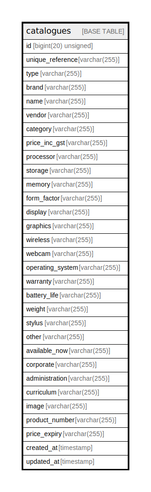

# catalogues

## Description

<details>
<summary><strong>Table Definition</strong></summary>

```sql
CREATE TABLE `catalogues` (
  `id` bigint(20) unsigned NOT NULL AUTO_INCREMENT,
  `unique_reference` varchar(255) COLLATE utf8mb4_unicode_ci NOT NULL,
  `type` varchar(255) COLLATE utf8mb4_unicode_ci NOT NULL,
  `brand` varchar(255) COLLATE utf8mb4_unicode_ci NOT NULL,
  `name` varchar(255) COLLATE utf8mb4_unicode_ci NOT NULL,
  `vendor` varchar(255) COLLATE utf8mb4_unicode_ci NOT NULL,
  `category` varchar(255) COLLATE utf8mb4_unicode_ci DEFAULT NULL,
  `price_inc_gst` varchar(255) COLLATE utf8mb4_unicode_ci DEFAULT NULL,
  `processor` varchar(255) COLLATE utf8mb4_unicode_ci DEFAULT NULL,
  `storage` varchar(255) COLLATE utf8mb4_unicode_ci DEFAULT NULL,
  `memory` varchar(255) COLLATE utf8mb4_unicode_ci DEFAULT NULL,
  `form_factor` varchar(255) COLLATE utf8mb4_unicode_ci DEFAULT NULL,
  `display` varchar(255) COLLATE utf8mb4_unicode_ci DEFAULT NULL,
  `graphics` varchar(255) COLLATE utf8mb4_unicode_ci DEFAULT NULL,
  `wireless` varchar(255) COLLATE utf8mb4_unicode_ci DEFAULT NULL,
  `webcam` varchar(255) COLLATE utf8mb4_unicode_ci DEFAULT NULL,
  `operating_system` varchar(255) COLLATE utf8mb4_unicode_ci DEFAULT NULL,
  `warranty` varchar(255) COLLATE utf8mb4_unicode_ci DEFAULT NULL,
  `battery_life` varchar(255) COLLATE utf8mb4_unicode_ci DEFAULT NULL,
  `weight` varchar(255) COLLATE utf8mb4_unicode_ci DEFAULT NULL,
  `stylus` varchar(255) COLLATE utf8mb4_unicode_ci DEFAULT NULL,
  `other` varchar(255) COLLATE utf8mb4_unicode_ci DEFAULT NULL,
  `available_now` varchar(255) COLLATE utf8mb4_unicode_ci DEFAULT NULL,
  `corporate` varchar(255) COLLATE utf8mb4_unicode_ci DEFAULT NULL,
  `administration` varchar(255) COLLATE utf8mb4_unicode_ci NOT NULL,
  `curriculum` varchar(255) COLLATE utf8mb4_unicode_ci DEFAULT NULL,
  `image` varchar(255) COLLATE utf8mb4_unicode_ci DEFAULT NULL,
  `product_number` varchar(255) COLLATE utf8mb4_unicode_ci DEFAULT NULL,
  `price_expiry` varchar(255) COLLATE utf8mb4_unicode_ci DEFAULT NULL,
  `created_at` timestamp NULL DEFAULT NULL,
  `updated_at` timestamp NULL DEFAULT NULL,
  PRIMARY KEY (`id`),
  UNIQUE KEY `catalogues_unique_reference_unique` (`unique_reference`),
  KEY `catalogue_index` (`type`,`brand`,`vendor`)
) ENGINE=InnoDB AUTO_INCREMENT=[Redacted by tbls] DEFAULT CHARSET=utf8mb4 COLLATE=utf8mb4_unicode_ci
```

</details>

## Columns

| Name | Type | Default | Nullable | Extra Definition | Children | Parents | Comment |
| ---- | ---- | ------- | -------- | ---------------- | -------- | ------- | ------- |
| id | bigint(20) unsigned |  | false | auto_increment |  |  |  |
| unique_reference | varchar(255) |  | false |  |  |  |  |
| type | varchar(255) |  | false |  |  |  |  |
| brand | varchar(255) |  | false |  |  |  |  |
| name | varchar(255) |  | false |  |  |  |  |
| vendor | varchar(255) |  | false |  |  |  |  |
| category | varchar(255) |  | true |  |  |  |  |
| price_inc_gst | varchar(255) |  | true |  |  |  |  |
| processor | varchar(255) |  | true |  |  |  |  |
| storage | varchar(255) |  | true |  |  |  |  |
| memory | varchar(255) |  | true |  |  |  |  |
| form_factor | varchar(255) |  | true |  |  |  |  |
| display | varchar(255) |  | true |  |  |  |  |
| graphics | varchar(255) |  | true |  |  |  |  |
| wireless | varchar(255) |  | true |  |  |  |  |
| webcam | varchar(255) |  | true |  |  |  |  |
| operating_system | varchar(255) |  | true |  |  |  |  |
| warranty | varchar(255) |  | true |  |  |  |  |
| battery_life | varchar(255) |  | true |  |  |  |  |
| weight | varchar(255) |  | true |  |  |  |  |
| stylus | varchar(255) |  | true |  |  |  |  |
| other | varchar(255) |  | true |  |  |  |  |
| available_now | varchar(255) |  | true |  |  |  |  |
| corporate | varchar(255) |  | true |  |  |  |  |
| administration | varchar(255) |  | false |  |  |  |  |
| curriculum | varchar(255) |  | true |  |  |  |  |
| image | varchar(255) |  | true |  |  |  |  |
| product_number | varchar(255) |  | true |  |  |  |  |
| price_expiry | varchar(255) |  | true |  |  |  |  |
| created_at | timestamp |  | true |  |  |  |  |
| updated_at | timestamp |  | true |  |  |  |  |

## Constraints

| Name | Type | Definition |
| ---- | ---- | ---------- |
| catalogues_unique_reference_unique | UNIQUE | UNIQUE KEY catalogues_unique_reference_unique (unique_reference) |
| PRIMARY | PRIMARY KEY | PRIMARY KEY (id) |

## Indexes

| Name | Definition |
| ---- | ---------- |
| catalogue_index | KEY catalogue_index (type, brand, vendor) USING BTREE |
| PRIMARY | PRIMARY KEY (id) USING BTREE |
| catalogues_unique_reference_unique | UNIQUE KEY catalogues_unique_reference_unique (unique_reference) USING BTREE |

## Relations



---

> Generated by [tbls](https://github.com/k1LoW/tbls)
