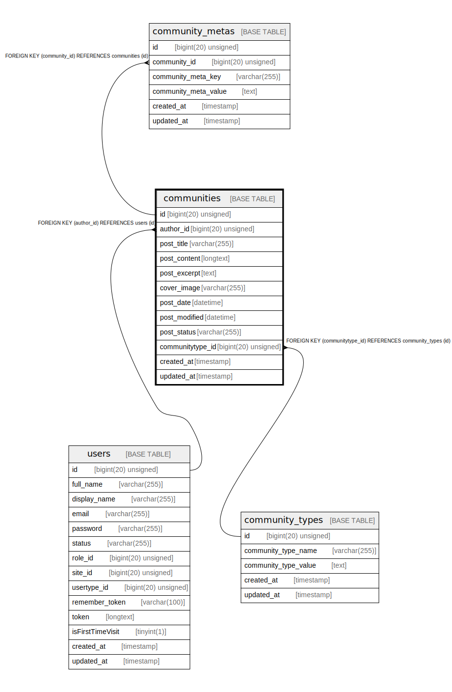

# communities

## Description

<details>
<summary><strong>Table Definition</strong></summary>

```sql
CREATE TABLE `communities` (
  `id` bigint(20) unsigned NOT NULL AUTO_INCREMENT,
  `author_id` bigint(20) unsigned DEFAULT NULL,
  `post_title` varchar(255) COLLATE utf8mb4_unicode_ci NOT NULL,
  `post_content` longtext COLLATE utf8mb4_unicode_ci NOT NULL,
  `post_excerpt` text COLLATE utf8mb4_unicode_ci,
  `cover_image` varchar(255) COLLATE utf8mb4_unicode_ci DEFAULT NULL,
  `post_date` datetime DEFAULT NULL,
  `post_modified` datetime DEFAULT NULL,
  `post_status` varchar(255) COLLATE utf8mb4_unicode_ci NOT NULL,
  `communitytype_id` bigint(20) unsigned DEFAULT NULL,
  `created_at` timestamp NULL DEFAULT NULL,
  `updated_at` timestamp NULL DEFAULT NULL,
  PRIMARY KEY (`id`),
  KEY `communities_author_id_foreign` (`author_id`),
  KEY `communities_communitytype_id_foreign` (`communitytype_id`),
  CONSTRAINT `communities_author_id_foreign` FOREIGN KEY (`author_id`) REFERENCES `users` (`id`) ON DELETE CASCADE,
  CONSTRAINT `communities_communitytype_id_foreign` FOREIGN KEY (`communitytype_id`) REFERENCES `community_types` (`id`) ON DELETE CASCADE
) ENGINE=InnoDB AUTO_INCREMENT=[Redacted by tbls] DEFAULT CHARSET=utf8mb4 COLLATE=utf8mb4_unicode_ci
```

</details>

## Columns

| Name | Type | Default | Nullable | Extra Definition | Children | Parents | Comment |
| ---- | ---- | ------- | -------- | ---------------- | -------- | ------- | ------- |
| id | bigint(20) unsigned |  | false | auto_increment | [community_metas](community_metas.md) |  |  |
| author_id | bigint(20) unsigned |  | true |  |  | [users](users.md) |  |
| post_title | varchar(255) |  | false |  |  |  |  |
| post_content | longtext |  | false |  |  |  |  |
| post_excerpt | text |  | true |  |  |  |  |
| cover_image | varchar(255) |  | true |  |  |  |  |
| post_date | datetime |  | true |  |  |  |  |
| post_modified | datetime |  | true |  |  |  |  |
| post_status | varchar(255) |  | false |  |  |  |  |
| communitytype_id | bigint(20) unsigned |  | true |  |  | [community_types](community_types.md) |  |
| created_at | timestamp |  | true |  |  |  |  |
| updated_at | timestamp |  | true |  |  |  |  |

## Constraints

| Name | Type | Definition |
| ---- | ---- | ---------- |
| communities_author_id_foreign | FOREIGN KEY | FOREIGN KEY (author_id) REFERENCES users (id) |
| communities_communitytype_id_foreign | FOREIGN KEY | FOREIGN KEY (communitytype_id) REFERENCES community_types (id) |
| PRIMARY | PRIMARY KEY | PRIMARY KEY (id) |

## Indexes

| Name | Definition |
| ---- | ---------- |
| communities_author_id_foreign | KEY communities_author_id_foreign (author_id) USING BTREE |
| communities_communitytype_id_foreign | KEY communities_communitytype_id_foreign (communitytype_id) USING BTREE |
| PRIMARY | PRIMARY KEY (id) USING BTREE |

## Relations



---

> Generated by [tbls](https://github.com/k1LoW/tbls)
