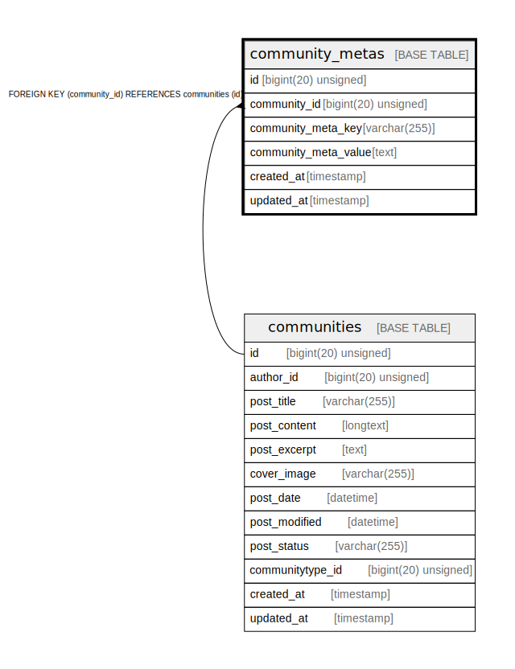

# community_metas

## Description

<details>
<summary><strong>Table Definition</strong></summary>

```sql
CREATE TABLE `community_metas` (
  `id` bigint(20) unsigned NOT NULL AUTO_INCREMENT,
  `community_id` bigint(20) unsigned DEFAULT NULL,
  `community_meta_key` varchar(255) COLLATE utf8mb4_unicode_ci NOT NULL,
  `community_meta_value` text COLLATE utf8mb4_unicode_ci NOT NULL,
  `created_at` timestamp NULL DEFAULT NULL,
  `updated_at` timestamp NULL DEFAULT NULL,
  PRIMARY KEY (`id`),
  KEY `community_metas_community_id_foreign` (`community_id`),
  CONSTRAINT `community_metas_community_id_foreign` FOREIGN KEY (`community_id`) REFERENCES `communities` (`id`) ON DELETE CASCADE
) ENGINE=InnoDB DEFAULT CHARSET=utf8mb4 COLLATE=utf8mb4_unicode_ci
```

</details>

## Columns

| Name | Type | Default | Nullable | Extra Definition | Children | Parents | Comment |
| ---- | ---- | ------- | -------- | ---------------- | -------- | ------- | ------- |
| id | bigint(20) unsigned |  | false | auto_increment |  |  |  |
| community_id | bigint(20) unsigned |  | true |  |  | [communities](communities.md) |  |
| community_meta_key | varchar(255) |  | false |  |  |  |  |
| community_meta_value | text |  | false |  |  |  |  |
| created_at | timestamp |  | true |  |  |  |  |
| updated_at | timestamp |  | true |  |  |  |  |

## Constraints

| Name | Type | Definition |
| ---- | ---- | ---------- |
| community_metas_community_id_foreign | FOREIGN KEY | FOREIGN KEY (community_id) REFERENCES communities (id) |
| PRIMARY | PRIMARY KEY | PRIMARY KEY (id) |

## Indexes

| Name | Definition |
| ---- | ---------- |
| community_metas_community_id_foreign | KEY community_metas_community_id_foreign (community_id) USING BTREE |
| PRIMARY | PRIMARY KEY (id) USING BTREE |

## Relations



---

> Generated by [tbls](https://github.com/k1LoW/tbls)
