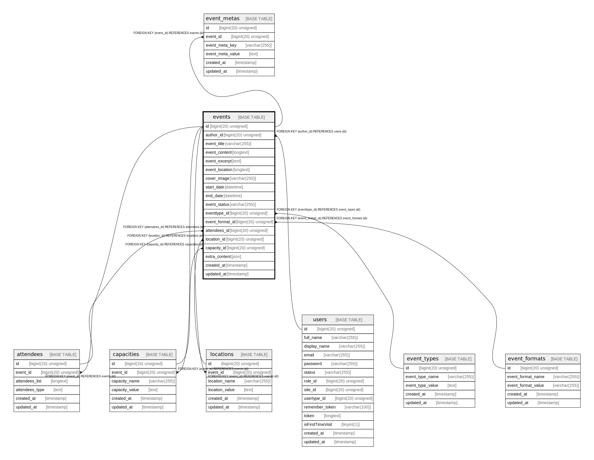

# events

## Description

<details>
<summary><strong>Table Definition</strong></summary>

```sql
CREATE TABLE `events` (
  `id` bigint(20) unsigned NOT NULL AUTO_INCREMENT,
  `author_id` bigint(20) unsigned DEFAULT NULL,
  `event_title` varchar(255) COLLATE utf8mb4_unicode_ci NOT NULL,
  `event_content` longtext COLLATE utf8mb4_unicode_ci NOT NULL,
  `event_excerpt` text COLLATE utf8mb4_unicode_ci,
  `event_location` longtext COLLATE utf8mb4_unicode_ci,
  `cover_image` varchar(255) COLLATE utf8mb4_unicode_ci DEFAULT NULL,
  `start_date` datetime NOT NULL,
  `end_date` datetime NOT NULL,
  `event_status` varchar(255) COLLATE utf8mb4_unicode_ci NOT NULL,
  `eventtype_id` bigint(20) unsigned DEFAULT NULL,
  `event_format_id` bigint(20) unsigned DEFAULT NULL,
  `attendees_id` bigint(20) unsigned DEFAULT NULL,
  `location_id` bigint(20) unsigned DEFAULT NULL,
  `capacity_id` bigint(20) unsigned DEFAULT NULL,
  `extra_content` json DEFAULT NULL,
  `created_at` timestamp NULL DEFAULT NULL,
  `updated_at` timestamp NULL DEFAULT NULL,
  PRIMARY KEY (`id`),
  KEY `events_author_id_foreign` (`author_id`),
  KEY `events_eventtype_id_foreign` (`eventtype_id`),
  KEY `events_attendees_id_foreign` (`attendees_id`),
  KEY `events_location_id_foreign` (`location_id`),
  KEY `events_capacity_id_foreign` (`capacity_id`),
  KEY `events_event_format_id_foreign` (`event_format_id`),
  CONSTRAINT `events_attendees_id_foreign` FOREIGN KEY (`attendees_id`) REFERENCES `attendees` (`id`) ON DELETE CASCADE,
  CONSTRAINT `events_author_id_foreign` FOREIGN KEY (`author_id`) REFERENCES `users` (`id`) ON DELETE CASCADE,
  CONSTRAINT `events_capacity_id_foreign` FOREIGN KEY (`capacity_id`) REFERENCES `capacities` (`id`) ON DELETE CASCADE,
  CONSTRAINT `events_event_format_id_foreign` FOREIGN KEY (`event_format_id`) REFERENCES `event_formats` (`id`) ON DELETE SET NULL,
  CONSTRAINT `events_eventtype_id_foreign` FOREIGN KEY (`eventtype_id`) REFERENCES `event_types` (`id`) ON DELETE CASCADE,
  CONSTRAINT `events_location_id_foreign` FOREIGN KEY (`location_id`) REFERENCES `locations` (`id`) ON DELETE CASCADE
) ENGINE=InnoDB AUTO_INCREMENT=[Redacted by tbls] DEFAULT CHARSET=utf8mb4 COLLATE=utf8mb4_unicode_ci
```

</details>

## Columns

| Name | Type | Default | Nullable | Extra Definition | Children | Parents | Comment |
| ---- | ---- | ------- | -------- | ---------------- | -------- | ------- | ------- |
| id | bigint(20) unsigned |  | false | auto_increment | [attendees](attendees.md) [capacities](capacities.md) [event_metas](event_metas.md) [locations](locations.md) |  |  |
| author_id | bigint(20) unsigned |  | true |  |  | [users](users.md) |  |
| event_title | varchar(255) |  | false |  |  |  |  |
| event_content | longtext |  | false |  |  |  |  |
| event_excerpt | text |  | true |  |  |  |  |
| event_location | longtext |  | true |  |  |  |  |
| cover_image | varchar(255) |  | true |  |  |  |  |
| start_date | datetime |  | false |  |  |  |  |
| end_date | datetime |  | false |  |  |  |  |
| event_status | varchar(255) |  | false |  |  |  |  |
| eventtype_id | bigint(20) unsigned |  | true |  |  | [event_types](event_types.md) |  |
| event_format_id | bigint(20) unsigned |  | true |  |  | [event_formats](event_formats.md) |  |
| attendees_id | bigint(20) unsigned |  | true |  |  | [attendees](attendees.md) |  |
| location_id | bigint(20) unsigned |  | true |  |  | [locations](locations.md) |  |
| capacity_id | bigint(20) unsigned |  | true |  |  | [capacities](capacities.md) |  |
| extra_content | json |  | true |  |  |  |  |
| created_at | timestamp |  | true |  |  |  |  |
| updated_at | timestamp |  | true |  |  |  |  |

## Constraints

| Name | Type | Definition |
| ---- | ---- | ---------- |
| events_attendees_id_foreign | FOREIGN KEY | FOREIGN KEY (attendees_id) REFERENCES attendees (id) |
| events_author_id_foreign | FOREIGN KEY | FOREIGN KEY (author_id) REFERENCES users (id) |
| events_capacity_id_foreign | FOREIGN KEY | FOREIGN KEY (capacity_id) REFERENCES capacities (id) |
| events_eventtype_id_foreign | FOREIGN KEY | FOREIGN KEY (eventtype_id) REFERENCES event_types (id) |
| events_event_format_id_foreign | FOREIGN KEY | FOREIGN KEY (event_format_id) REFERENCES event_formats (id) |
| events_location_id_foreign | FOREIGN KEY | FOREIGN KEY (location_id) REFERENCES locations (id) |
| PRIMARY | PRIMARY KEY | PRIMARY KEY (id) |

## Indexes

| Name | Definition |
| ---- | ---------- |
| events_attendees_id_foreign | KEY events_attendees_id_foreign (attendees_id) USING BTREE |
| events_author_id_foreign | KEY events_author_id_foreign (author_id) USING BTREE |
| events_capacity_id_foreign | KEY events_capacity_id_foreign (capacity_id) USING BTREE |
| events_eventtype_id_foreign | KEY events_eventtype_id_foreign (eventtype_id) USING BTREE |
| events_event_format_id_foreign | KEY events_event_format_id_foreign (event_format_id) USING BTREE |
| events_location_id_foreign | KEY events_location_id_foreign (location_id) USING BTREE |
| PRIMARY | PRIMARY KEY (id) USING BTREE |

## Relations



---

> Generated by [tbls](https://github.com/k1LoW/tbls)
