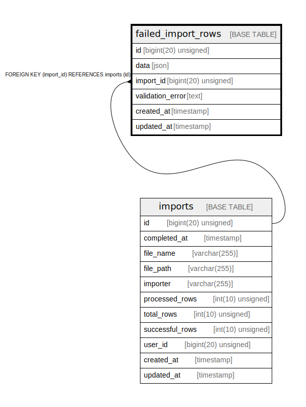

# failed_import_rows

## Description

<details>
<summary><strong>Table Definition</strong></summary>

```sql
CREATE TABLE `failed_import_rows` (
  `id` bigint(20) unsigned NOT NULL AUTO_INCREMENT,
  `data` json NOT NULL,
  `import_id` bigint(20) unsigned NOT NULL,
  `validation_error` text COLLATE utf8mb4_unicode_ci,
  `created_at` timestamp NULL DEFAULT NULL,
  `updated_at` timestamp NULL DEFAULT NULL,
  PRIMARY KEY (`id`),
  KEY `failed_import_rows_import_id_foreign` (`import_id`),
  CONSTRAINT `failed_import_rows_import_id_foreign` FOREIGN KEY (`import_id`) REFERENCES `imports` (`id`) ON DELETE CASCADE
) ENGINE=InnoDB AUTO_INCREMENT=[Redacted by tbls] DEFAULT CHARSET=utf8mb4 COLLATE=utf8mb4_unicode_ci
```

</details>

## Columns

| Name | Type | Default | Nullable | Extra Definition | Children | Parents | Comment |
| ---- | ---- | ------- | -------- | ---------------- | -------- | ------- | ------- |
| id | bigint(20) unsigned |  | false | auto_increment |  |  |  |
| data | json |  | false |  |  |  |  |
| import_id | bigint(20) unsigned |  | false |  |  | [imports](imports.md) |  |
| validation_error | text |  | true |  |  |  |  |
| created_at | timestamp |  | true |  |  |  |  |
| updated_at | timestamp |  | true |  |  |  |  |

## Constraints

| Name | Type | Definition |
| ---- | ---- | ---------- |
| failed_import_rows_import_id_foreign | FOREIGN KEY | FOREIGN KEY (import_id) REFERENCES imports (id) |
| PRIMARY | PRIMARY KEY | PRIMARY KEY (id) |

## Indexes

| Name | Definition |
| ---- | ---------- |
| failed_import_rows_import_id_foreign | KEY failed_import_rows_import_id_foreign (import_id) USING BTREE |
| PRIMARY | PRIMARY KEY (id) USING BTREE |

## Relations



---

> Generated by [tbls](https://github.com/k1LoW/tbls)
