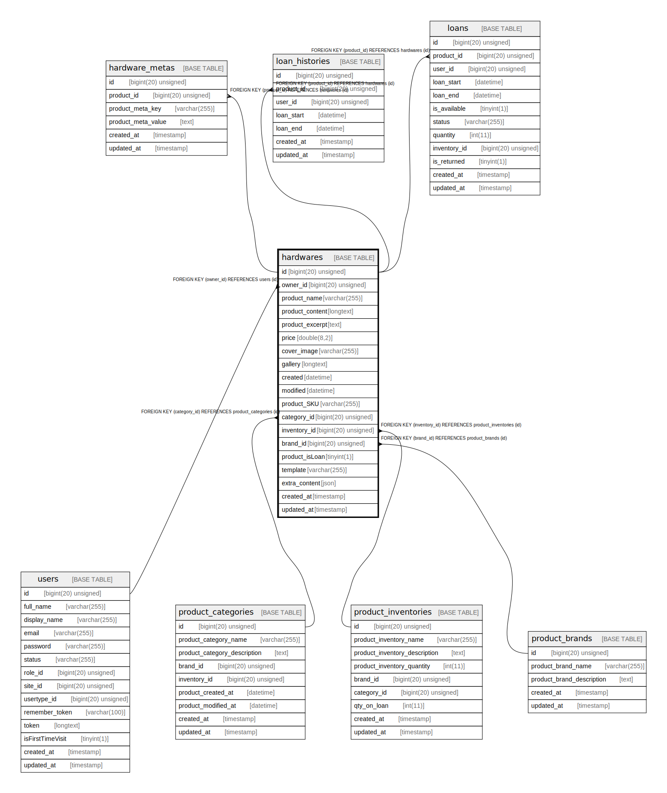

# hardwares

## Description

<details>
<summary><strong>Table Definition</strong></summary>

```sql
CREATE TABLE `hardwares` (
  `id` bigint(20) unsigned NOT NULL AUTO_INCREMENT,
  `owner_id` bigint(20) unsigned DEFAULT NULL,
  `product_name` varchar(255) COLLATE utf8mb4_unicode_ci NOT NULL,
  `product_content` longtext COLLATE utf8mb4_unicode_ci NOT NULL,
  `product_excerpt` text COLLATE utf8mb4_unicode_ci,
  `price` double(8,2) NOT NULL,
  `cover_image` varchar(255) COLLATE utf8mb4_unicode_ci DEFAULT NULL,
  `gallery` longtext COLLATE utf8mb4_unicode_ci,
  `created` datetime DEFAULT NULL,
  `modified` datetime DEFAULT NULL,
  `product_SKU` varchar(255) COLLATE utf8mb4_unicode_ci DEFAULT NULL,
  `category_id` bigint(20) unsigned DEFAULT NULL,
  `inventory_id` bigint(20) unsigned DEFAULT NULL,
  `brand_id` bigint(20) unsigned DEFAULT NULL,
  `product_isLoan` tinyint(1) DEFAULT NULL,
  `template` varchar(255) COLLATE utf8mb4_unicode_ci DEFAULT NULL,
  `extra_content` json DEFAULT NULL,
  `created_at` timestamp NULL DEFAULT NULL,
  `updated_at` timestamp NULL DEFAULT NULL,
  PRIMARY KEY (`id`),
  KEY `hardwares_owner_id_foreign` (`owner_id`),
  KEY `hardwares_category_id_foreign` (`category_id`),
  KEY `hardwares_inventory_id_foreign` (`inventory_id`),
  KEY `hardwares_brand_id_foreign` (`brand_id`),
  CONSTRAINT `hardwares_brand_id_foreign` FOREIGN KEY (`brand_id`) REFERENCES `product_brands` (`id`) ON DELETE CASCADE,
  CONSTRAINT `hardwares_category_id_foreign` FOREIGN KEY (`category_id`) REFERENCES `product_categories` (`id`) ON DELETE CASCADE,
  CONSTRAINT `hardwares_inventory_id_foreign` FOREIGN KEY (`inventory_id`) REFERENCES `product_inventories` (`id`) ON DELETE CASCADE,
  CONSTRAINT `hardwares_owner_id_foreign` FOREIGN KEY (`owner_id`) REFERENCES `users` (`id`) ON DELETE CASCADE
) ENGINE=InnoDB AUTO_INCREMENT=[Redacted by tbls] DEFAULT CHARSET=utf8mb4 COLLATE=utf8mb4_unicode_ci
```

</details>

## Columns

| Name | Type | Default | Nullable | Extra Definition | Children | Parents | Comment |
| ---- | ---- | ------- | -------- | ---------------- | -------- | ------- | ------- |
| id | bigint(20) unsigned |  | false | auto_increment | [hardware_metas](hardware_metas.md) [loan_histories](loan_histories.md) [loans](loans.md) |  |  |
| owner_id | bigint(20) unsigned |  | true |  |  | [users](users.md) |  |
| product_name | varchar(255) |  | false |  |  |  |  |
| product_content | longtext |  | false |  |  |  |  |
| product_excerpt | text |  | true |  |  |  |  |
| price | double(8,2) |  | false |  |  |  |  |
| cover_image | varchar(255) |  | true |  |  |  |  |
| gallery | longtext |  | true |  |  |  |  |
| created | datetime |  | true |  |  |  |  |
| modified | datetime |  | true |  |  |  |  |
| product_SKU | varchar(255) |  | true |  |  |  |  |
| category_id | bigint(20) unsigned |  | true |  |  | [product_categories](product_categories.md) |  |
| inventory_id | bigint(20) unsigned |  | true |  |  | [product_inventories](product_inventories.md) |  |
| brand_id | bigint(20) unsigned |  | true |  |  | [product_brands](product_brands.md) |  |
| product_isLoan | tinyint(1) |  | true |  |  |  |  |
| template | varchar(255) |  | true |  |  |  |  |
| extra_content | json |  | true |  |  |  |  |
| created_at | timestamp |  | true |  |  |  |  |
| updated_at | timestamp |  | true |  |  |  |  |

## Constraints

| Name | Type | Definition |
| ---- | ---- | ---------- |
| hardwares_brand_id_foreign | FOREIGN KEY | FOREIGN KEY (brand_id) REFERENCES product_brands (id) |
| hardwares_category_id_foreign | FOREIGN KEY | FOREIGN KEY (category_id) REFERENCES product_categories (id) |
| hardwares_inventory_id_foreign | FOREIGN KEY | FOREIGN KEY (inventory_id) REFERENCES product_inventories (id) |
| hardwares_owner_id_foreign | FOREIGN KEY | FOREIGN KEY (owner_id) REFERENCES users (id) |
| PRIMARY | PRIMARY KEY | PRIMARY KEY (id) |

## Indexes

| Name | Definition |
| ---- | ---------- |
| hardwares_brand_id_foreign | KEY hardwares_brand_id_foreign (brand_id) USING BTREE |
| hardwares_category_id_foreign | KEY hardwares_category_id_foreign (category_id) USING BTREE |
| hardwares_inventory_id_foreign | KEY hardwares_inventory_id_foreign (inventory_id) USING BTREE |
| hardwares_owner_id_foreign | KEY hardwares_owner_id_foreign (owner_id) USING BTREE |
| PRIMARY | PRIMARY KEY (id) USING BTREE |

## Relations



---

> Generated by [tbls](https://github.com/k1LoW/tbls)
