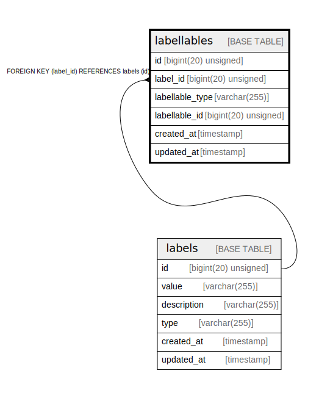

# labellables

## Description

<details>
<summary><strong>Table Definition</strong></summary>

```sql
CREATE TABLE `labellables` (
  `id` bigint(20) unsigned NOT NULL AUTO_INCREMENT,
  `label_id` bigint(20) unsigned NOT NULL,
  `labellable_type` varchar(255) COLLATE utf8mb4_unicode_ci NOT NULL,
  `labellable_id` bigint(20) unsigned NOT NULL,
  `created_at` timestamp NULL DEFAULT NULL,
  `updated_at` timestamp NULL DEFAULT NULL,
  PRIMARY KEY (`id`),
  UNIQUE KEY `labellables_label_id_labellable_type_labellable_id_unique` (`label_id`,`labellable_type`,`labellable_id`),
  KEY `labellables_labellable_type_labellable_id_index` (`labellable_type`,`labellable_id`),
  CONSTRAINT `labellables_label_id_foreign` FOREIGN KEY (`label_id`) REFERENCES `labels` (`id`) ON DELETE CASCADE
) ENGINE=InnoDB AUTO_INCREMENT=[Redacted by tbls] DEFAULT CHARSET=utf8mb4 COLLATE=utf8mb4_unicode_ci
```

</details>

## Columns

| Name | Type | Default | Nullable | Extra Definition | Children | Parents | Comment |
| ---- | ---- | ------- | -------- | ---------------- | -------- | ------- | ------- |
| id | bigint(20) unsigned |  | false | auto_increment |  |  |  |
| label_id | bigint(20) unsigned |  | false |  |  | [labels](labels.md) |  |
| labellable_type | varchar(255) |  | false |  |  |  |  |
| labellable_id | bigint(20) unsigned |  | false |  |  |  |  |
| created_at | timestamp |  | true |  |  |  |  |
| updated_at | timestamp |  | true |  |  |  |  |

## Constraints

| Name | Type | Definition |
| ---- | ---- | ---------- |
| labellables_label_id_foreign | FOREIGN KEY | FOREIGN KEY (label_id) REFERENCES labels (id) |
| labellables_label_id_labellable_type_labellable_id_unique | UNIQUE | UNIQUE KEY labellables_label_id_labellable_type_labellable_id_unique (label_id, labellable_type, labellable_id) |
| PRIMARY | PRIMARY KEY | PRIMARY KEY (id) |

## Indexes

| Name | Definition |
| ---- | ---------- |
| labellables_labellable_type_labellable_id_index | KEY labellables_labellable_type_labellable_id_index (labellable_type, labellable_id) USING BTREE |
| PRIMARY | PRIMARY KEY (id) USING BTREE |
| labellables_label_id_labellable_type_labellable_id_unique | UNIQUE KEY labellables_label_id_labellable_type_labellable_id_unique (label_id, labellable_type, labellable_id) USING BTREE |

## Relations



---

> Generated by [tbls](https://github.com/k1LoW/tbls)
