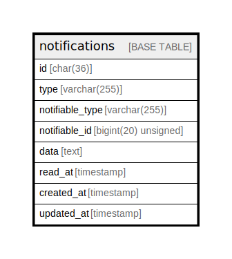

# notifications

## Description

<details>
<summary><strong>Table Definition</strong></summary>

```sql
CREATE TABLE `notifications` (
  `id` char(36) COLLATE utf8mb4_unicode_ci NOT NULL,
  `type` varchar(255) COLLATE utf8mb4_unicode_ci NOT NULL,
  `notifiable_type` varchar(255) COLLATE utf8mb4_unicode_ci NOT NULL,
  `notifiable_id` bigint(20) unsigned NOT NULL,
  `data` text COLLATE utf8mb4_unicode_ci NOT NULL,
  `read_at` timestamp NULL DEFAULT NULL,
  `created_at` timestamp NULL DEFAULT NULL,
  `updated_at` timestamp NULL DEFAULT NULL,
  PRIMARY KEY (`id`),
  KEY `notifications_notifiable_type_notifiable_id_index` (`notifiable_type`,`notifiable_id`)
) ENGINE=InnoDB DEFAULT CHARSET=utf8mb4 COLLATE=utf8mb4_unicode_ci
```

</details>

## Columns

| Name | Type | Default | Nullable | Children | Parents | Comment |
| ---- | ---- | ------- | -------- | -------- | ------- | ------- |
| id | char(36) |  | false |  |  |  |
| type | varchar(255) |  | false |  |  |  |
| notifiable_type | varchar(255) |  | false |  |  |  |
| notifiable_id | bigint(20) unsigned |  | false |  |  |  |
| data | text |  | false |  |  |  |
| read_at | timestamp |  | true |  |  |  |
| created_at | timestamp |  | true |  |  |  |
| updated_at | timestamp |  | true |  |  |  |

## Constraints

| Name | Type | Definition |
| ---- | ---- | ---------- |
| PRIMARY | PRIMARY KEY | PRIMARY KEY (id) |

## Indexes

| Name | Definition |
| ---- | ---------- |
| notifications_notifiable_type_notifiable_id_index | KEY notifications_notifiable_type_notifiable_id_index (notifiable_type, notifiable_id) USING BTREE |
| PRIMARY | PRIMARY KEY (id) USING BTREE |

## Relations



---

> Generated by [tbls](https://github.com/k1LoW/tbls)
