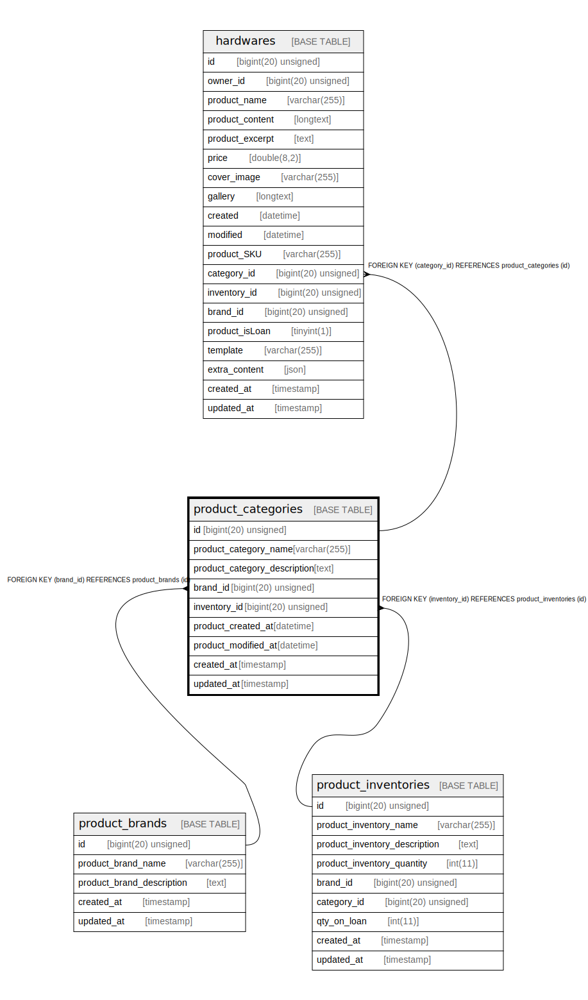

# product_categories

## Description

<details>
<summary><strong>Table Definition</strong></summary>

```sql
CREATE TABLE `product_categories` (
  `id` bigint(20) unsigned NOT NULL AUTO_INCREMENT,
  `product_category_name` varchar(255) COLLATE utf8mb4_unicode_ci NOT NULL,
  `product_category_description` text COLLATE utf8mb4_unicode_ci,
  `brand_id` bigint(20) unsigned DEFAULT NULL,
  `inventory_id` bigint(20) unsigned DEFAULT NULL,
  `product_created_at` datetime DEFAULT NULL,
  `product_modified_at` datetime DEFAULT NULL,
  `created_at` timestamp NULL DEFAULT NULL,
  `updated_at` timestamp NULL DEFAULT NULL,
  PRIMARY KEY (`id`),
  KEY `product_categories_brand_id_foreign` (`brand_id`),
  KEY `product_categories_inventory_id_foreign` (`inventory_id`),
  CONSTRAINT `product_categories_brand_id_foreign` FOREIGN KEY (`brand_id`) REFERENCES `product_brands` (`id`) ON DELETE CASCADE,
  CONSTRAINT `product_categories_inventory_id_foreign` FOREIGN KEY (`inventory_id`) REFERENCES `product_inventories` (`id`) ON DELETE CASCADE
) ENGINE=InnoDB AUTO_INCREMENT=[Redacted by tbls] DEFAULT CHARSET=utf8mb4 COLLATE=utf8mb4_unicode_ci
```

</details>

## Columns

| Name | Type | Default | Nullable | Extra Definition | Children | Parents | Comment |
| ---- | ---- | ------- | -------- | ---------------- | -------- | ------- | ------- |
| id | bigint(20) unsigned |  | false | auto_increment | [hardwares](hardwares.md) |  |  |
| product_category_name | varchar(255) |  | false |  |  |  |  |
| product_category_description | text |  | true |  |  |  |  |
| brand_id | bigint(20) unsigned |  | true |  |  | [product_brands](product_brands.md) |  |
| inventory_id | bigint(20) unsigned |  | true |  |  | [product_inventories](product_inventories.md) |  |
| product_created_at | datetime |  | true |  |  |  |  |
| product_modified_at | datetime |  | true |  |  |  |  |
| created_at | timestamp |  | true |  |  |  |  |
| updated_at | timestamp |  | true |  |  |  |  |

## Constraints

| Name | Type | Definition |
| ---- | ---- | ---------- |
| PRIMARY | PRIMARY KEY | PRIMARY KEY (id) |
| product_categories_brand_id_foreign | FOREIGN KEY | FOREIGN KEY (brand_id) REFERENCES product_brands (id) |
| product_categories_inventory_id_foreign | FOREIGN KEY | FOREIGN KEY (inventory_id) REFERENCES product_inventories (id) |

## Indexes

| Name | Definition |
| ---- | ---------- |
| product_categories_brand_id_foreign | KEY product_categories_brand_id_foreign (brand_id) USING BTREE |
| product_categories_inventory_id_foreign | KEY product_categories_inventory_id_foreign (inventory_id) USING BTREE |
| PRIMARY | PRIMARY KEY (id) USING BTREE |

## Relations



---

> Generated by [tbls](https://github.com/k1LoW/tbls)
