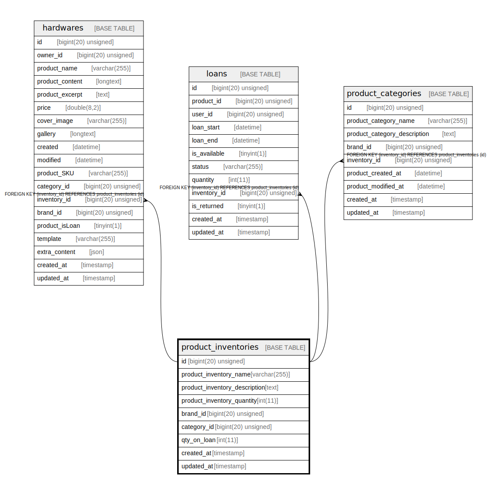

# product_inventories

## Description

<details>
<summary><strong>Table Definition</strong></summary>

```sql
CREATE TABLE `product_inventories` (
  `id` bigint(20) unsigned NOT NULL AUTO_INCREMENT,
  `product_inventory_name` varchar(255) COLLATE utf8mb4_unicode_ci NOT NULL,
  `product_inventory_description` text COLLATE utf8mb4_unicode_ci,
  `product_inventory_quantity` int(11) NOT NULL,
  `brand_id` bigint(20) unsigned DEFAULT NULL,
  `category_id` bigint(20) unsigned DEFAULT NULL,
  `qty_on_loan` int(11) NOT NULL,
  `created_at` timestamp NULL DEFAULT NULL,
  `updated_at` timestamp NULL DEFAULT NULL,
  PRIMARY KEY (`id`),
  KEY `product_inventories_brand_id_foreign` (`brand_id`),
  KEY `product_inventories_category_id_foreign` (`category_id`)
) ENGINE=InnoDB DEFAULT CHARSET=utf8mb4 COLLATE=utf8mb4_unicode_ci
```

</details>

## Columns

| Name | Type | Default | Nullable | Extra Definition | Children | Parents | Comment |
| ---- | ---- | ------- | -------- | ---------------- | -------- | ------- | ------- |
| id | bigint(20) unsigned |  | false | auto_increment | [hardwares](hardwares.md) [loans](loans.md) [product_categories](product_categories.md) |  |  |
| product_inventory_name | varchar(255) |  | false |  |  |  |  |
| product_inventory_description | text |  | true |  |  |  |  |
| product_inventory_quantity | int(11) |  | false |  |  |  |  |
| brand_id | bigint(20) unsigned |  | true |  |  |  |  |
| category_id | bigint(20) unsigned |  | true |  |  |  |  |
| qty_on_loan | int(11) |  | false |  |  |  |  |
| created_at | timestamp |  | true |  |  |  |  |
| updated_at | timestamp |  | true |  |  |  |  |

## Constraints

| Name | Type | Definition |
| ---- | ---- | ---------- |
| PRIMARY | PRIMARY KEY | PRIMARY KEY (id) |

## Indexes

| Name | Definition |
| ---- | ---------- |
| product_inventories_brand_id_foreign | KEY product_inventories_brand_id_foreign (brand_id) USING BTREE |
| product_inventories_category_id_foreign | KEY product_inventories_category_id_foreign (category_id) USING BTREE |
| PRIMARY | PRIMARY KEY (id) USING BTREE |

## Relations



---

> Generated by [tbls](https://github.com/k1LoW/tbls)
