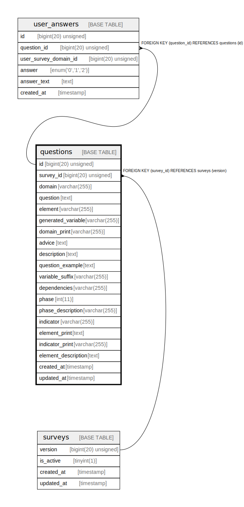

# questions

## Description

<details>
<summary><strong>Table Definition</strong></summary>

```sql
CREATE TABLE `questions` (
  `id` bigint(20) unsigned NOT NULL AUTO_INCREMENT,
  `survey_id` bigint(20) unsigned NOT NULL,
  `domain` varchar(255) COLLATE utf8mb4_unicode_ci NOT NULL,
  `question` text COLLATE utf8mb4_unicode_ci NOT NULL,
  `element` varchar(255) COLLATE utf8mb4_unicode_ci NOT NULL,
  `generated_variable` varchar(255) COLLATE utf8mb4_unicode_ci NOT NULL,
  `domain_print` varchar(255) COLLATE utf8mb4_unicode_ci DEFAULT NULL,
  `advice` text COLLATE utf8mb4_unicode_ci,
  `description` text COLLATE utf8mb4_unicode_ci,
  `question_example` text COLLATE utf8mb4_unicode_ci,
  `variable_suffix` varchar(255) COLLATE utf8mb4_unicode_ci DEFAULT NULL,
  `dependencies` varchar(255) COLLATE utf8mb4_unicode_ci DEFAULT NULL,
  `phase` int(11) DEFAULT NULL,
  `phase_description` varchar(255) COLLATE utf8mb4_unicode_ci DEFAULT NULL,
  `indicator` varchar(255) COLLATE utf8mb4_unicode_ci DEFAULT NULL,
  `element_print` text COLLATE utf8mb4_unicode_ci,
  `indicator_print` varchar(255) COLLATE utf8mb4_unicode_ci DEFAULT NULL,
  `element_description` text COLLATE utf8mb4_unicode_ci,
  `created_at` timestamp NULL DEFAULT NULL,
  `updated_at` timestamp NULL DEFAULT NULL,
  PRIMARY KEY (`id`),
  KEY `questions_survey_id_index` (`survey_id`),
  CONSTRAINT `questions_survey_id_foreign` FOREIGN KEY (`survey_id`) REFERENCES `surveys` (`version`) ON DELETE CASCADE
) ENGINE=InnoDB AUTO_INCREMENT=[Redacted by tbls] DEFAULT CHARSET=utf8mb4 COLLATE=utf8mb4_unicode_ci
```

</details>

## Columns

| Name | Type | Default | Nullable | Extra Definition | Children | Parents | Comment |
| ---- | ---- | ------- | -------- | ---------------- | -------- | ------- | ------- |
| id | bigint(20) unsigned |  | false | auto_increment | [user_answers](user_answers.md) |  |  |
| survey_id | bigint(20) unsigned |  | false |  |  | [surveys](surveys.md) |  |
| domain | varchar(255) |  | false |  |  |  |  |
| question | text |  | false |  |  |  |  |
| element | varchar(255) |  | false |  |  |  |  |
| generated_variable | varchar(255) |  | false |  |  |  |  |
| domain_print | varchar(255) |  | true |  |  |  |  |
| advice | text |  | true |  |  |  |  |
| description | text |  | true |  |  |  |  |
| question_example | text |  | true |  |  |  |  |
| variable_suffix | varchar(255) |  | true |  |  |  |  |
| dependencies | varchar(255) |  | true |  |  |  |  |
| phase | int(11) |  | true |  |  |  |  |
| phase_description | varchar(255) |  | true |  |  |  |  |
| indicator | varchar(255) |  | true |  |  |  |  |
| element_print | text |  | true |  |  |  |  |
| indicator_print | varchar(255) |  | true |  |  |  |  |
| element_description | text |  | true |  |  |  |  |
| created_at | timestamp |  | true |  |  |  |  |
| updated_at | timestamp |  | true |  |  |  |  |

## Constraints

| Name | Type | Definition |
| ---- | ---- | ---------- |
| PRIMARY | PRIMARY KEY | PRIMARY KEY (id) |
| questions_survey_id_foreign | FOREIGN KEY | FOREIGN KEY (survey_id) REFERENCES surveys (version) |

## Indexes

| Name | Definition |
| ---- | ---------- |
| questions_survey_id_index | KEY questions_survey_id_index (survey_id) USING BTREE |
| PRIMARY | PRIMARY KEY (id) USING BTREE |

## Relations



---

> Generated by [tbls](https://github.com/k1LoW/tbls)
