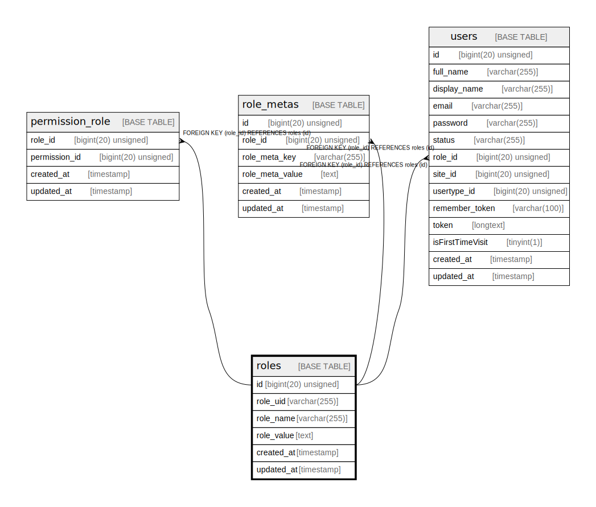

# roles

## Description

<details>
<summary><strong>Table Definition</strong></summary>

```sql
CREATE TABLE `roles` (
  `id` bigint(20) unsigned NOT NULL AUTO_INCREMENT,
  `role_uid` varchar(255) COLLATE utf8mb4_unicode_ci DEFAULT NULL,
  `role_name` varchar(255) COLLATE utf8mb4_unicode_ci NOT NULL,
  `role_value` text COLLATE utf8mb4_unicode_ci NOT NULL,
  `created_at` timestamp NULL DEFAULT NULL,
  `updated_at` timestamp NULL DEFAULT NULL,
  PRIMARY KEY (`id`),
  UNIQUE KEY `roles_role_uid_unique` (`role_uid`)
) ENGINE=InnoDB AUTO_INCREMENT=[Redacted by tbls] DEFAULT CHARSET=utf8mb4 COLLATE=utf8mb4_unicode_ci
```

</details>

## Columns

| Name | Type | Default | Nullable | Extra Definition | Children | Parents | Comment |
| ---- | ---- | ------- | -------- | ---------------- | -------- | ------- | ------- |
| id | bigint(20) unsigned |  | false | auto_increment | [permission_role](permission_role.md) [role_metas](role_metas.md) [users](users.md) |  |  |
| role_uid | varchar(255) |  | true |  |  |  |  |
| role_name | varchar(255) |  | false |  |  |  |  |
| role_value | text |  | false |  |  |  |  |
| created_at | timestamp |  | true |  |  |  |  |
| updated_at | timestamp |  | true |  |  |  |  |

## Constraints

| Name | Type | Definition |
| ---- | ---- | ---------- |
| PRIMARY | PRIMARY KEY | PRIMARY KEY (id) |
| roles_role_uid_unique | UNIQUE | UNIQUE KEY roles_role_uid_unique (role_uid) |

## Indexes

| Name | Definition |
| ---- | ---------- |
| PRIMARY | PRIMARY KEY (id) USING BTREE |
| roles_role_uid_unique | UNIQUE KEY roles_role_uid_unique (role_uid) USING BTREE |

## Relations



---

> Generated by [tbls](https://github.com/k1LoW/tbls)
