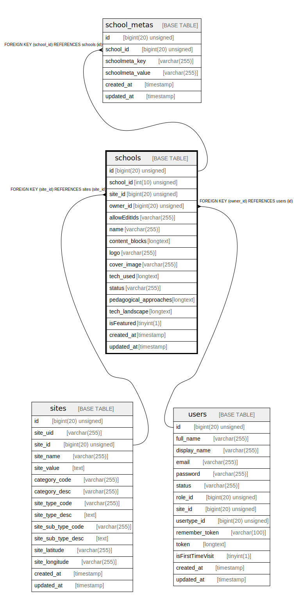

# schools

## Description

<details>
<summary><strong>Table Definition</strong></summary>

```sql
CREATE TABLE `schools` (
  `id` bigint(20) unsigned NOT NULL AUTO_INCREMENT,
  `school_id` int(10) unsigned NOT NULL,
  `site_id` bigint(20) unsigned DEFAULT NULL,
  `owner_id` bigint(20) unsigned DEFAULT NULL,
  `allowEditIds` varchar(255) COLLATE utf8mb4_unicode_ci DEFAULT NULL,
  `name` varchar(255) COLLATE utf8mb4_unicode_ci NOT NULL,
  `content_blocks` longtext COLLATE utf8mb4_unicode_ci,
  `logo` varchar(255) COLLATE utf8mb4_unicode_ci DEFAULT NULL,
  `cover_image` varchar(255) COLLATE utf8mb4_unicode_ci DEFAULT NULL,
  `tech_used` longtext COLLATE utf8mb4_unicode_ci,
  `status` varchar(255) COLLATE utf8mb4_unicode_ci NOT NULL DEFAULT 'Pending',
  `pedagogical_approaches` longtext COLLATE utf8mb4_unicode_ci,
  `tech_landscape` longtext COLLATE utf8mb4_unicode_ci,
  `isFeatured` tinyint(1) NOT NULL DEFAULT '0',
  `created_at` timestamp NULL DEFAULT NULL,
  `updated_at` timestamp NULL DEFAULT NULL,
  PRIMARY KEY (`id`),
  KEY `schools_owner_id_foreign` (`owner_id`),
  KEY `schools_site_id_foreign` (`site_id`),
  CONSTRAINT `schools_owner_id_foreign` FOREIGN KEY (`owner_id`) REFERENCES `users` (`id`) ON DELETE CASCADE,
  CONSTRAINT `schools_site_id_foreign` FOREIGN KEY (`site_id`) REFERENCES `sites` (`site_id`) ON DELETE CASCADE
) ENGINE=InnoDB AUTO_INCREMENT=[Redacted by tbls] DEFAULT CHARSET=utf8mb4 COLLATE=utf8mb4_unicode_ci
```

</details>

## Columns

| Name | Type | Default | Nullable | Extra Definition | Children | Parents | Comment |
| ---- | ---- | ------- | -------- | ---------------- | -------- | ------- | ------- |
| id | bigint(20) unsigned |  | false | auto_increment | [school_metas](school_metas.md) |  |  |
| school_id | int(10) unsigned |  | false |  |  |  |  |
| site_id | bigint(20) unsigned |  | true |  |  | [sites](sites.md) |  |
| owner_id | bigint(20) unsigned |  | true |  |  | [users](users.md) |  |
| allowEditIds | varchar(255) |  | true |  |  |  |  |
| name | varchar(255) |  | false |  |  |  |  |
| content_blocks | longtext |  | true |  |  |  |  |
| logo | varchar(255) |  | true |  |  |  |  |
| cover_image | varchar(255) |  | true |  |  |  |  |
| tech_used | longtext |  | true |  |  |  |  |
| status | varchar(255) | Pending | false |  |  |  |  |
| pedagogical_approaches | longtext |  | true |  |  |  |  |
| tech_landscape | longtext |  | true |  |  |  |  |
| isFeatured | tinyint(1) | 0 | false |  |  |  |  |
| created_at | timestamp |  | true |  |  |  |  |
| updated_at | timestamp |  | true |  |  |  |  |

## Constraints

| Name | Type | Definition |
| ---- | ---- | ---------- |
| PRIMARY | PRIMARY KEY | PRIMARY KEY (id) |
| schools_owner_id_foreign | FOREIGN KEY | FOREIGN KEY (owner_id) REFERENCES users (id) |
| schools_site_id_foreign | FOREIGN KEY | FOREIGN KEY (site_id) REFERENCES sites (site_id) |

## Indexes

| Name | Definition |
| ---- | ---------- |
| schools_owner_id_foreign | KEY schools_owner_id_foreign (owner_id) USING BTREE |
| schools_site_id_foreign | KEY schools_site_id_foreign (site_id) USING BTREE |
| PRIMARY | PRIMARY KEY (id) USING BTREE |

## Relations



---

> Generated by [tbls](https://github.com/k1LoW/tbls)
