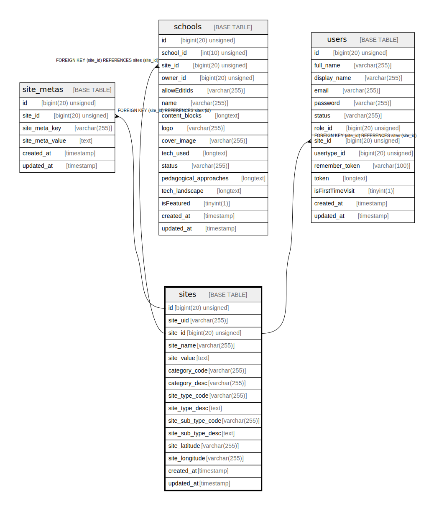

# sites

## Description

<details>
<summary><strong>Table Definition</strong></summary>

```sql
CREATE TABLE `sites` (
  `id` bigint(20) unsigned NOT NULL AUTO_INCREMENT,
  `site_uid` varchar(255) COLLATE utf8mb4_unicode_ci DEFAULT NULL,
  `site_id` bigint(20) unsigned DEFAULT NULL,
  `site_name` varchar(255) COLLATE utf8mb4_unicode_ci NOT NULL,
  `site_value` text COLLATE utf8mb4_unicode_ci,
  `category_code` varchar(255) COLLATE utf8mb4_unicode_ci DEFAULT NULL,
  `category_desc` varchar(255) COLLATE utf8mb4_unicode_ci DEFAULT NULL,
  `site_type_code` varchar(255) COLLATE utf8mb4_unicode_ci DEFAULT NULL,
  `site_type_desc` text COLLATE utf8mb4_unicode_ci,
  `site_sub_type_code` varchar(255) COLLATE utf8mb4_unicode_ci DEFAULT NULL,
  `site_sub_type_desc` text COLLATE utf8mb4_unicode_ci,
  `site_latitude` varchar(255) COLLATE utf8mb4_unicode_ci DEFAULT NULL,
  `site_longitude` varchar(255) COLLATE utf8mb4_unicode_ci DEFAULT NULL,
  `created_at` timestamp NULL DEFAULT NULL,
  `updated_at` timestamp NULL DEFAULT NULL,
  PRIMARY KEY (`id`),
  UNIQUE KEY `sites_site_uid_unique` (`site_uid`),
  UNIQUE KEY `sites_site_id_unique` (`site_id`)
) ENGINE=InnoDB AUTO_INCREMENT=[Redacted by tbls] DEFAULT CHARSET=utf8mb4 COLLATE=utf8mb4_unicode_ci
```

</details>

## Columns

| Name | Type | Default | Nullable | Extra Definition | Children | Parents | Comment |
| ---- | ---- | ------- | -------- | ---------------- | -------- | ------- | ------- |
| id | bigint(20) unsigned |  | false | auto_increment | [site_metas](site_metas.md) |  |  |
| site_uid | varchar(255) |  | true |  |  |  |  |
| site_id | bigint(20) unsigned |  | true |  | [schools](schools.md) [users](users.md) |  |  |
| site_name | varchar(255) |  | false |  |  |  |  |
| site_value | text |  | true |  |  |  |  |
| category_code | varchar(255) |  | true |  |  |  |  |
| category_desc | varchar(255) |  | true |  |  |  |  |
| site_type_code | varchar(255) |  | true |  |  |  |  |
| site_type_desc | text |  | true |  |  |  |  |
| site_sub_type_code | varchar(255) |  | true |  |  |  |  |
| site_sub_type_desc | text |  | true |  |  |  |  |
| site_latitude | varchar(255) |  | true |  |  |  |  |
| site_longitude | varchar(255) |  | true |  |  |  |  |
| created_at | timestamp |  | true |  |  |  |  |
| updated_at | timestamp |  | true |  |  |  |  |

## Constraints

| Name | Type | Definition |
| ---- | ---- | ---------- |
| PRIMARY | PRIMARY KEY | PRIMARY KEY (id) |
| sites_site_id_unique | UNIQUE | UNIQUE KEY sites_site_id_unique (site_id) |
| sites_site_uid_unique | UNIQUE | UNIQUE KEY sites_site_uid_unique (site_uid) |

## Indexes

| Name | Definition |
| ---- | ---------- |
| PRIMARY | PRIMARY KEY (id) USING BTREE |
| sites_site_id_unique | UNIQUE KEY sites_site_id_unique (site_id) USING BTREE |
| sites_site_uid_unique | UNIQUE KEY sites_site_uid_unique (site_uid) USING BTREE |

## Relations



---

> Generated by [tbls](https://github.com/k1LoW/tbls)
