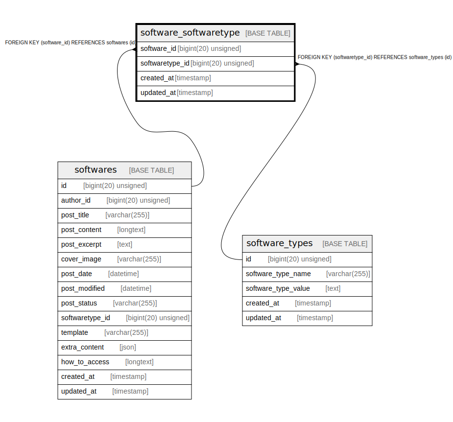

# software_softwaretype

## Description

<details>
<summary><strong>Table Definition</strong></summary>

```sql
CREATE TABLE `software_softwaretype` (
  `software_id` bigint(20) unsigned NOT NULL,
  `softwaretype_id` bigint(20) unsigned NOT NULL,
  `created_at` timestamp NULL DEFAULT NULL,
  `updated_at` timestamp NULL DEFAULT NULL,
  KEY `software_softwaretype_software_id_foreign` (`software_id`),
  KEY `software_softwaretype_softwaretype_id_foreign` (`softwaretype_id`),
  CONSTRAINT `software_softwaretype_software_id_foreign` FOREIGN KEY (`software_id`) REFERENCES `softwares` (`id`) ON DELETE CASCADE,
  CONSTRAINT `software_softwaretype_softwaretype_id_foreign` FOREIGN KEY (`softwaretype_id`) REFERENCES `software_types` (`id`) ON DELETE CASCADE
) ENGINE=InnoDB DEFAULT CHARSET=utf8mb4 COLLATE=utf8mb4_unicode_ci
```

</details>

## Columns

| Name | Type | Default | Nullable | Children | Parents | Comment |
| ---- | ---- | ------- | -------- | -------- | ------- | ------- |
| software_id | bigint(20) unsigned |  | false |  | [softwares](softwares.md) |  |
| softwaretype_id | bigint(20) unsigned |  | false |  | [software_types](software_types.md) |  |
| created_at | timestamp |  | true |  |  |  |
| updated_at | timestamp |  | true |  |  |  |

## Constraints

| Name | Type | Definition |
| ---- | ---- | ---------- |
| software_softwaretype_softwaretype_id_foreign | FOREIGN KEY | FOREIGN KEY (softwaretype_id) REFERENCES software_types (id) |
| software_softwaretype_software_id_foreign | FOREIGN KEY | FOREIGN KEY (software_id) REFERENCES softwares (id) |

## Indexes

| Name | Definition |
| ---- | ---------- |
| software_softwaretype_softwaretype_id_foreign | KEY software_softwaretype_softwaretype_id_foreign (softwaretype_id) USING BTREE |
| software_softwaretype_software_id_foreign | KEY software_softwaretype_software_id_foreign (software_id) USING BTREE |

## Relations



---

> Generated by [tbls](https://github.com/k1LoW/tbls)
