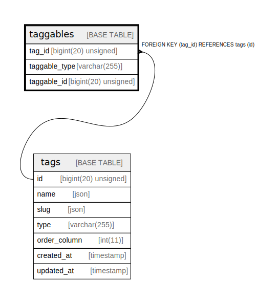

# taggables

## Description

<details>
<summary><strong>Table Definition</strong></summary>

```sql
CREATE TABLE `taggables` (
  `tag_id` bigint(20) unsigned NOT NULL,
  `taggable_type` varchar(255) COLLATE utf8mb4_unicode_ci NOT NULL,
  `taggable_id` bigint(20) unsigned NOT NULL,
  UNIQUE KEY `taggables_tag_id_taggable_id_taggable_type_unique` (`tag_id`,`taggable_id`,`taggable_type`),
  KEY `taggables_taggable_type_taggable_id_index` (`taggable_type`,`taggable_id`),
  CONSTRAINT `taggables_tag_id_foreign` FOREIGN KEY (`tag_id`) REFERENCES `tags` (`id`) ON DELETE CASCADE
) ENGINE=InnoDB DEFAULT CHARSET=utf8mb4 COLLATE=utf8mb4_unicode_ci
```

</details>

## Columns

| Name | Type | Default | Nullable | Children | Parents | Comment |
| ---- | ---- | ------- | -------- | -------- | ------- | ------- |
| tag_id | bigint(20) unsigned |  | false |  | [tags](tags.md) |  |
| taggable_type | varchar(255) |  | false |  |  |  |
| taggable_id | bigint(20) unsigned |  | false |  |  |  |

## Constraints

| Name | Type | Definition |
| ---- | ---- | ---------- |
| taggables_tag_id_foreign | FOREIGN KEY | FOREIGN KEY (tag_id) REFERENCES tags (id) |
| taggables_tag_id_taggable_id_taggable_type_unique | UNIQUE | UNIQUE KEY taggables_tag_id_taggable_id_taggable_type_unique (tag_id, taggable_id, taggable_type) |

## Indexes

| Name | Definition |
| ---- | ---------- |
| taggables_taggable_type_taggable_id_index | KEY taggables_taggable_type_taggable_id_index (taggable_type, taggable_id) USING BTREE |
| taggables_tag_id_taggable_id_taggable_type_unique | UNIQUE KEY taggables_tag_id_taggable_id_taggable_type_unique (tag_id, taggable_id, taggable_type) USING BTREE |

## Relations



---

> Generated by [tbls](https://github.com/k1LoW/tbls)
