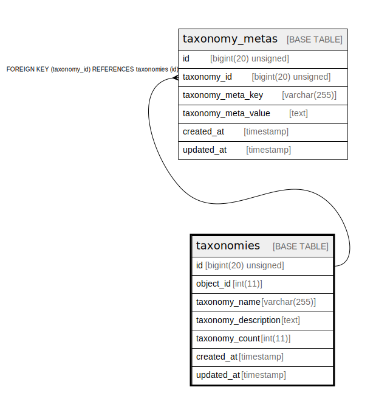

# taxonomies

## Description

<details>
<summary><strong>Table Definition</strong></summary>

```sql
CREATE TABLE `taxonomies` (
  `id` bigint(20) unsigned NOT NULL AUTO_INCREMENT,
  `object_id` int(11) NOT NULL,
  `taxonomy_name` varchar(255) COLLATE utf8mb4_unicode_ci NOT NULL,
  `taxonomy_description` text COLLATE utf8mb4_unicode_ci NOT NULL,
  `taxonomy_count` int(11) NOT NULL,
  `created_at` timestamp NULL DEFAULT NULL,
  `updated_at` timestamp NULL DEFAULT NULL,
  PRIMARY KEY (`id`)
) ENGINE=InnoDB DEFAULT CHARSET=utf8mb4 COLLATE=utf8mb4_unicode_ci
```

</details>

## Columns

| Name | Type | Default | Nullable | Extra Definition | Children | Parents | Comment |
| ---- | ---- | ------- | -------- | ---------------- | -------- | ------- | ------- |
| id | bigint(20) unsigned |  | false | auto_increment | [taxonomy_metas](taxonomy_metas.md) |  |  |
| object_id | int(11) |  | false |  |  |  |  |
| taxonomy_name | varchar(255) |  | false |  |  |  |  |
| taxonomy_description | text |  | false |  |  |  |  |
| taxonomy_count | int(11) |  | false |  |  |  |  |
| created_at | timestamp |  | true |  |  |  |  |
| updated_at | timestamp |  | true |  |  |  |  |

## Constraints

| Name | Type | Definition |
| ---- | ---- | ---------- |
| PRIMARY | PRIMARY KEY | PRIMARY KEY (id) |

## Indexes

| Name | Definition |
| ---- | ---------- |
| PRIMARY | PRIMARY KEY (id) USING BTREE |

## Relations



---

> Generated by [tbls](https://github.com/k1LoW/tbls)
