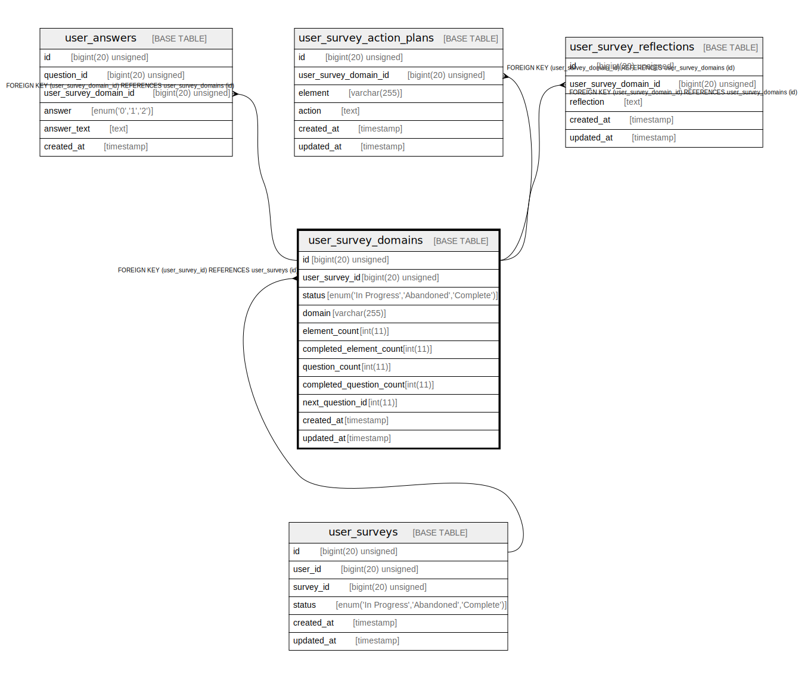

# user_survey_domains

## Description

<details>
<summary><strong>Table Definition</strong></summary>

```sql
CREATE TABLE `user_survey_domains` (
  `id` bigint(20) unsigned NOT NULL AUTO_INCREMENT,
  `user_survey_id` bigint(20) unsigned NOT NULL,
  `status` enum('In Progress','Abandoned','Complete') COLLATE utf8mb4_unicode_ci NOT NULL,
  `domain` varchar(255) COLLATE utf8mb4_unicode_ci NOT NULL,
  `element_count` int(11) NOT NULL,
  `completed_element_count` int(11) NOT NULL,
  `question_count` int(11) NOT NULL,
  `completed_question_count` int(11) NOT NULL,
  `next_question_id` int(11) DEFAULT NULL,
  `created_at` timestamp NULL DEFAULT NULL,
  `updated_at` timestamp NULL DEFAULT NULL,
  PRIMARY KEY (`id`),
  KEY `user_survey_domains_user_survey_id_foreign` (`user_survey_id`),
  CONSTRAINT `user_survey_domains_user_survey_id_foreign` FOREIGN KEY (`user_survey_id`) REFERENCES `user_surveys` (`id`) ON DELETE CASCADE
) ENGINE=InnoDB AUTO_INCREMENT=[Redacted by tbls] DEFAULT CHARSET=utf8mb4 COLLATE=utf8mb4_unicode_ci
```

</details>

## Columns

| Name | Type | Default | Nullable | Extra Definition | Children | Parents | Comment |
| ---- | ---- | ------- | -------- | ---------------- | -------- | ------- | ------- |
| id | bigint(20) unsigned |  | false | auto_increment | [user_answers](user_answers.md) [user_survey_action_plans](user_survey_action_plans.md) [user_survey_reflections](user_survey_reflections.md) |  |  |
| user_survey_id | bigint(20) unsigned |  | false |  |  | [user_surveys](user_surveys.md) |  |
| status | enum('In Progress','Abandoned','Complete') |  | false |  |  |  |  |
| domain | varchar(255) |  | false |  |  |  |  |
| element_count | int(11) |  | false |  |  |  |  |
| completed_element_count | int(11) |  | false |  |  |  |  |
| question_count | int(11) |  | false |  |  |  |  |
| completed_question_count | int(11) |  | false |  |  |  |  |
| next_question_id | int(11) |  | true |  |  |  |  |
| created_at | timestamp |  | true |  |  |  |  |
| updated_at | timestamp |  | true |  |  |  |  |

## Constraints

| Name | Type | Definition |
| ---- | ---- | ---------- |
| PRIMARY | PRIMARY KEY | PRIMARY KEY (id) |
| user_survey_domains_user_survey_id_foreign | FOREIGN KEY | FOREIGN KEY (user_survey_id) REFERENCES user_surveys (id) |

## Indexes

| Name | Definition |
| ---- | ---------- |
| user_survey_domains_user_survey_id_foreign | KEY user_survey_domains_user_survey_id_foreign (user_survey_id) USING BTREE |
| PRIMARY | PRIMARY KEY (id) USING BTREE |

## Relations



---

> Generated by [tbls](https://github.com/k1LoW/tbls)
