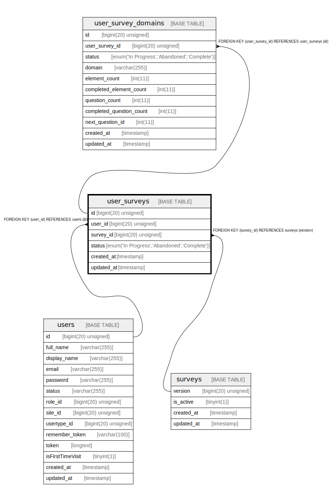

# user_surveys

## Description

<details>
<summary><strong>Table Definition</strong></summary>

```sql
CREATE TABLE `user_surveys` (
  `id` bigint(20) unsigned NOT NULL AUTO_INCREMENT,
  `user_id` bigint(20) unsigned NOT NULL,
  `survey_id` bigint(20) unsigned NOT NULL,
  `status` enum('In Progress','Abandoned','Complete') COLLATE utf8mb4_unicode_ci NOT NULL,
  `created_at` timestamp NULL DEFAULT NULL,
  `updated_at` timestamp NULL DEFAULT NULL,
  PRIMARY KEY (`id`),
  KEY `user_surveys_user_id_foreign` (`user_id`),
  KEY `user_surveys_survey_id_foreign` (`survey_id`),
  CONSTRAINT `user_surveys_survey_id_foreign` FOREIGN KEY (`survey_id`) REFERENCES `surveys` (`version`) ON DELETE CASCADE,
  CONSTRAINT `user_surveys_user_id_foreign` FOREIGN KEY (`user_id`) REFERENCES `users` (`id`) ON DELETE CASCADE
) ENGINE=InnoDB AUTO_INCREMENT=[Redacted by tbls] DEFAULT CHARSET=utf8mb4 COLLATE=utf8mb4_unicode_ci
```

</details>

## Columns

| Name | Type | Default | Nullable | Extra Definition | Children | Parents | Comment |
| ---- | ---- | ------- | -------- | ---------------- | -------- | ------- | ------- |
| id | bigint(20) unsigned |  | false | auto_increment | [user_survey_domains](user_survey_domains.md) |  |  |
| user_id | bigint(20) unsigned |  | false |  |  | [users](users.md) |  |
| survey_id | bigint(20) unsigned |  | false |  |  | [surveys](surveys.md) |  |
| status | enum('In Progress','Abandoned','Complete') |  | false |  |  |  |  |
| created_at | timestamp |  | true |  |  |  |  |
| updated_at | timestamp |  | true |  |  |  |  |

## Constraints

| Name | Type | Definition |
| ---- | ---- | ---------- |
| PRIMARY | PRIMARY KEY | PRIMARY KEY (id) |
| user_surveys_survey_id_foreign | FOREIGN KEY | FOREIGN KEY (survey_id) REFERENCES surveys (version) |
| user_surveys_user_id_foreign | FOREIGN KEY | FOREIGN KEY (user_id) REFERENCES users (id) |

## Indexes

| Name | Definition |
| ---- | ---------- |
| user_surveys_survey_id_foreign | KEY user_surveys_survey_id_foreign (survey_id) USING BTREE |
| user_surveys_user_id_foreign | KEY user_surveys_user_id_foreign (user_id) USING BTREE |
| PRIMARY | PRIMARY KEY (id) USING BTREE |

## Relations



---

> Generated by [tbls](https://github.com/k1LoW/tbls)
