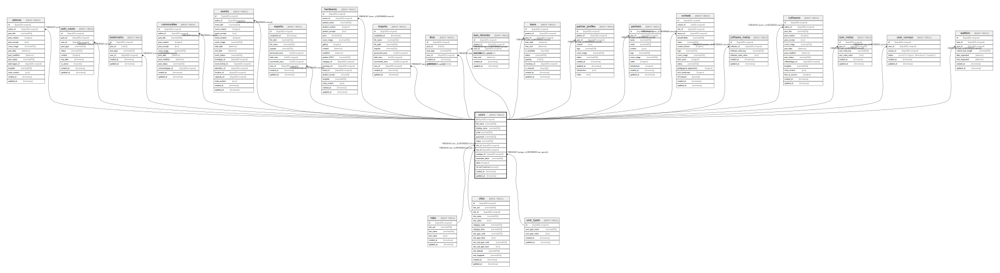

# users

## Description

<details>
<summary><strong>Table Definition</strong></summary>

```sql
CREATE TABLE `users` (
  `id` bigint(20) unsigned NOT NULL AUTO_INCREMENT,
  `full_name` varchar(255) COLLATE utf8mb4_unicode_ci NOT NULL,
  `display_name` varchar(255) COLLATE utf8mb4_unicode_ci DEFAULT NULL,
  `email` varchar(255) COLLATE utf8mb4_unicode_ci NOT NULL,
  `password` varchar(255) COLLATE utf8mb4_unicode_ci DEFAULT NULL,
  `status` varchar(255) COLLATE utf8mb4_unicode_ci DEFAULT NULL,
  `role_id` bigint(20) unsigned DEFAULT NULL,
  `site_id` bigint(20) unsigned DEFAULT NULL,
  `usertype_id` bigint(20) unsigned DEFAULT NULL,
  `remember_token` varchar(100) COLLATE utf8mb4_unicode_ci DEFAULT NULL,
  `token` longtext COLLATE utf8mb4_unicode_ci,
  `isFirstTimeVisit` tinyint(1) DEFAULT NULL,
  `created_at` timestamp NULL DEFAULT NULL,
  `updated_at` timestamp NULL DEFAULT NULL,
  PRIMARY KEY (`id`),
  KEY `users_role_id_foreign` (`role_id`),
  KEY `users_usertype_id_foreign` (`usertype_id`),
  KEY `users_site_id_foreign` (`site_id`),
  CONSTRAINT `users_role_id_foreign` FOREIGN KEY (`role_id`) REFERENCES `roles` (`id`) ON DELETE CASCADE,
  CONSTRAINT `users_site_id_foreign` FOREIGN KEY (`site_id`) REFERENCES `sites` (`site_id`) ON DELETE CASCADE,
  CONSTRAINT `users_usertype_id_foreign` FOREIGN KEY (`usertype_id`) REFERENCES `user_types` (`id`) ON DELETE CASCADE
) ENGINE=InnoDB AUTO_INCREMENT=[Redacted by tbls] DEFAULT CHARSET=utf8mb4 COLLATE=utf8mb4_unicode_ci
```

</details>

## Columns

| Name | Type | Default | Nullable | Extra Definition | Children | Parents | Comment |
| ---- | ---- | ------- | -------- | ---------------- | -------- | ------- | ------- |
| id | bigint(20) unsigned |  | false | auto_increment | [advices](advices.md) [auto_saves](auto_saves.md) [bookmarks](bookmarks.md) [communities](communities.md) [events](events.md) [exports](exports.md) [hardwares](hardwares.md) [imports](imports.md) [likes](likes.md) [loan_histories](loan_histories.md) [loans](loans.md) [partner_profiles](partner_profiles.md) [partners](partners.md) [schools](schools.md) [software_metas](software_metas.md) [softwares](softwares.md) [user_metas](user_metas.md) [user_surveys](user_surveys.md) [waitlists](waitlists.md) |  |  |
| full_name | varchar(255) |  | false |  |  |  |  |
| display_name | varchar(255) |  | true |  |  |  |  |
| email | varchar(255) |  | false |  |  |  |  |
| password | varchar(255) |  | true |  |  |  |  |
| status | varchar(255) |  | true |  |  |  |  |
| role_id | bigint(20) unsigned |  | true |  |  | [roles](roles.md) |  |
| site_id | bigint(20) unsigned |  | true |  |  | [sites](sites.md) |  |
| usertype_id | bigint(20) unsigned |  | true |  |  | [user_types](user_types.md) |  |
| remember_token | varchar(100) |  | true |  |  |  |  |
| token | longtext |  | true |  |  |  |  |
| isFirstTimeVisit | tinyint(1) |  | true |  |  |  |  |
| created_at | timestamp |  | true |  |  |  |  |
| updated_at | timestamp |  | true |  |  |  |  |

## Constraints

| Name | Type | Definition |
| ---- | ---- | ---------- |
| PRIMARY | PRIMARY KEY | PRIMARY KEY (id) |
| users_role_id_foreign | FOREIGN KEY | FOREIGN KEY (role_id) REFERENCES roles (id) |
| users_site_id_foreign | FOREIGN KEY | FOREIGN KEY (site_id) REFERENCES sites (site_id) |
| users_usertype_id_foreign | FOREIGN KEY | FOREIGN KEY (usertype_id) REFERENCES user_types (id) |

## Indexes

| Name | Definition |
| ---- | ---------- |
| users_role_id_foreign | KEY users_role_id_foreign (role_id) USING BTREE |
| users_site_id_foreign | KEY users_site_id_foreign (site_id) USING BTREE |
| users_usertype_id_foreign | KEY users_usertype_id_foreign (usertype_id) USING BTREE |
| PRIMARY | PRIMARY KEY (id) USING BTREE |

## Relations



---

> Generated by [tbls](https://github.com/k1LoW/tbls)
