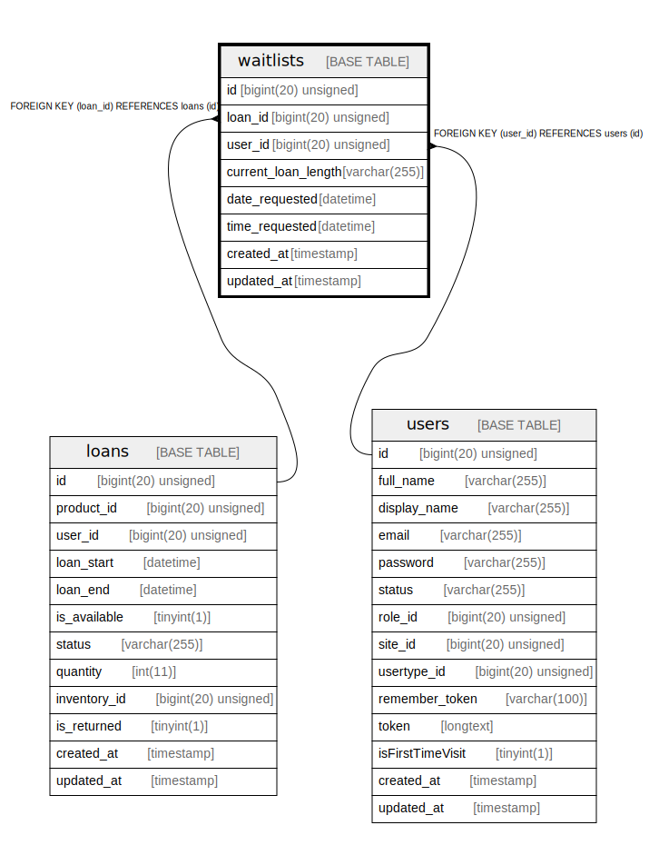

# waitlists

## Description

<details>
<summary><strong>Table Definition</strong></summary>

```sql
CREATE TABLE `waitlists` (
  `id` bigint(20) unsigned NOT NULL AUTO_INCREMENT,
  `loan_id` bigint(20) unsigned DEFAULT NULL,
  `user_id` bigint(20) unsigned DEFAULT NULL,
  `current_loan_length` varchar(255) COLLATE utf8mb4_unicode_ci NOT NULL,
  `date_requested` datetime NOT NULL,
  `time_requested` datetime NOT NULL,
  `created_at` timestamp NULL DEFAULT NULL,
  `updated_at` timestamp NULL DEFAULT NULL,
  PRIMARY KEY (`id`),
  KEY `waitlists_loan_id_foreign` (`loan_id`),
  KEY `waitlists_user_id_foreign` (`user_id`),
  CONSTRAINT `waitlists_loan_id_foreign` FOREIGN KEY (`loan_id`) REFERENCES `loans` (`id`) ON DELETE CASCADE,
  CONSTRAINT `waitlists_user_id_foreign` FOREIGN KEY (`user_id`) REFERENCES `users` (`id`) ON DELETE CASCADE
) ENGINE=InnoDB DEFAULT CHARSET=utf8mb4 COLLATE=utf8mb4_unicode_ci
```

</details>

## Columns

| Name | Type | Default | Nullable | Extra Definition | Children | Parents | Comment |
| ---- | ---- | ------- | -------- | ---------------- | -------- | ------- | ------- |
| id | bigint(20) unsigned |  | false | auto_increment |  |  |  |
| loan_id | bigint(20) unsigned |  | true |  |  | [loans](loans.md) |  |
| user_id | bigint(20) unsigned |  | true |  |  | [users](users.md) |  |
| current_loan_length | varchar(255) |  | false |  |  |  |  |
| date_requested | datetime |  | false |  |  |  |  |
| time_requested | datetime |  | false |  |  |  |  |
| created_at | timestamp |  | true |  |  |  |  |
| updated_at | timestamp |  | true |  |  |  |  |

## Constraints

| Name | Type | Definition |
| ---- | ---- | ---------- |
| PRIMARY | PRIMARY KEY | PRIMARY KEY (id) |
| waitlists_loan_id_foreign | FOREIGN KEY | FOREIGN KEY (loan_id) REFERENCES loans (id) |
| waitlists_user_id_foreign | FOREIGN KEY | FOREIGN KEY (user_id) REFERENCES users (id) |

## Indexes

| Name | Definition |
| ---- | ---------- |
| waitlists_loan_id_foreign | KEY waitlists_loan_id_foreign (loan_id) USING BTREE |
| waitlists_user_id_foreign | KEY waitlists_user_id_foreign (user_id) USING BTREE |
| PRIMARY | PRIMARY KEY (id) USING BTREE |

## Relations



---

> Generated by [tbls](https://github.com/k1LoW/tbls)
